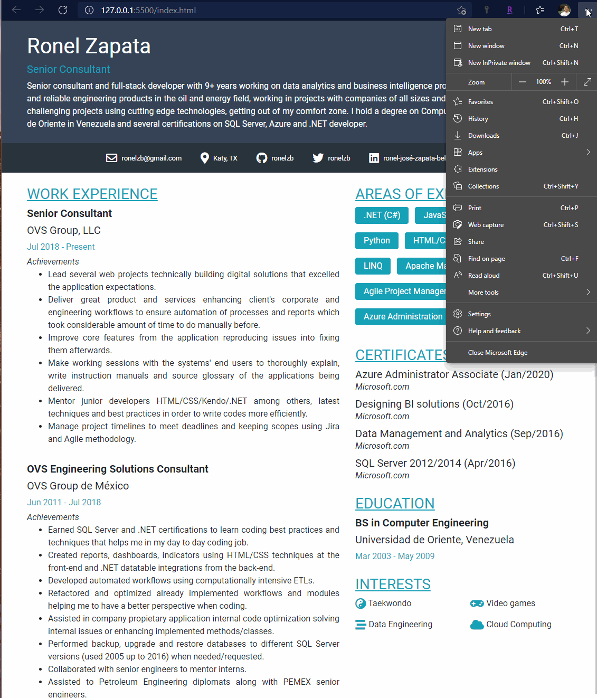

# CV/Resume to PDF

Every once in a while we want to update our Resume/CV but it becomes real difficult with so many paid third-party tools or consultancy services.

This repo was created to make my own professional Resume and help others like me struggling to create a creative, out-of-the-box and innovative Resume.

## How to

The page was done using `Bootstrap 4` and `font-awesome 5.15.x`, if you don't have any experience working with those I'd recommend you to read about them first.

You can use any editor of your choice, I used [VS Code](https://code.visualstudio.com/) and the extension [Live Server](https://marketplace.visualstudio.com/items?itemName=ritwickdey.LiveServer) to launch a local development server and preview my changes.

To view the page directly in the browser:

* Press `Ctrl + P` or `Print` in your browser settings.
* If your using Chrome or Edge, select `Save As PDF`, this option uses A4 format (roughly 1140px width) and won't mess with the CSS.
* Click on `More setting` at the Print settings panel.
* Select `None` or `Minimum` margins and check `Background graphics`.

## License

This extension is licensed under the [MIT License](https://github.com/ronelzb/cv_htmltopdf/blob/master/LICENSE).
